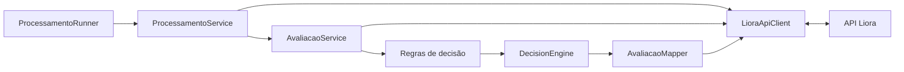
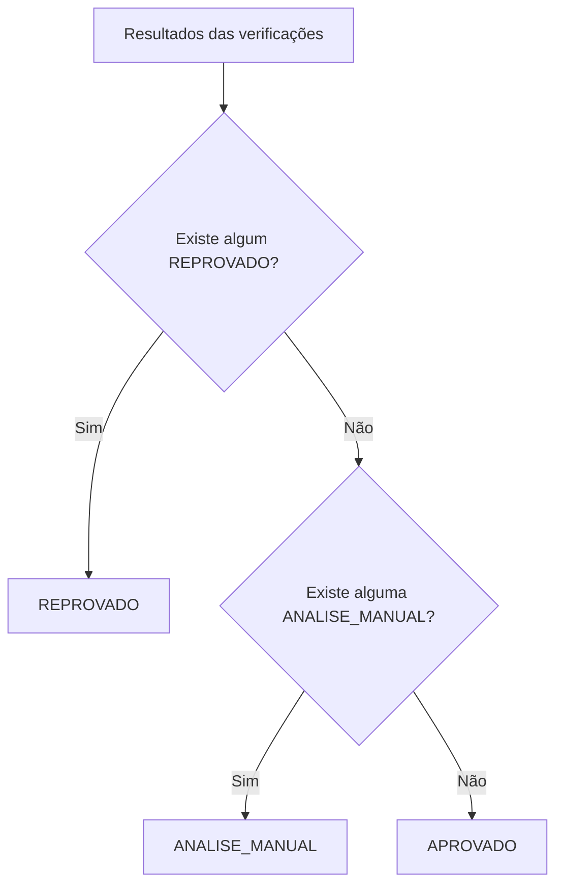

# Liora Credit Agent

Agente desenvolvido em **Java 21 e Spring Boot** para analisar solicitações de troca de titularidade de energia e classificá-las como:

- `aprovado`
- `reprovado`
- `analise_manual`

A aplicação consome os dados e serviços disponibilizados pela API da Liora, executa verificações independentes, consolida os resultados em um motor de decisão e envia a avaliação final para a API.

> O foco da implementação foi manter as decisões simples, explicáveis e rastreáveis, evitando criar critérios ou scores sem fundamentação nos dados disponíveis.

---

## Objetivo

Para cada solicitação, o agente considera dados cadastrais e consulta serviços auxiliares para verificar:

- idade do solicitante;
- titularidade da conta;
- blacklist de CPF;
- consistência do endereço;
- risco associado ao telefone;
- situação de débitos da instalação.

Após as verificações, uma decisão final é produzida e enviada para `POST /avaliacoes`.

---

## Tecnologias

- **Java 21**
- **Spring Boot 4.1.1**
- **Spring Web MVC**
- **Spring RestClient**
- **Maven**
- **JUnit 5**
- **Mockito**
- **MockWebServer**
- **Spring Boot Actuator**

O projeto inclui **Maven Wrapper**, portanto não é necessário possuir o Maven instalado globalmente.

---

## Arquitetura

A implementação separa integração HTTP, regras de negócio, consolidação da decisão e processamento da massa.



### Principais responsabilidades

| Componente | Responsabilidade |
|---|---|
| `LioraApiClient` | Centraliza a comunicação HTTP com a API |
| `AvaliacaoService` | Orquestra as verificações de uma solicitação |
| `Regra*` | Avalia individualmente cada critério de negócio |
| `DecisionEngine` | Consolida os resultados em uma decisão final |
| `AvaliacaoMapper` | Converte o resultado interno para o contrato de avaliação |
| `ProcessamentoService` | Percorre a massa paginada e isola falhas individuais |
| `ProcessamentoRunner` | Permite executar uma solicitação ou toda a massa |

Essa separação permite testar as regras de negócio independentemente das chamadas HTTP.

---

## Fluxo de avaliação

Cada verificação gera um dos seguintes estados:

```text
APROVADO
REPROVADO
ANALISE_MANUAL
```

O `DecisionEngine` utiliza a seguinte precedência:

```text
REPROVADO > ANALISE_MANUAL > APROVADO
```



Dessa forma:

- uma condição impeditiva prevalece sobre as demais;
- uma situação incerta impede aprovação automática;
- a solicitação somente é aprovada quando não existe reprovação nem necessidade de análise manual.

Não foi utilizada votação entre regras ou média de resultados, pois não foram fornecidos pesos oficiais para esse tipo de composição.

---

# Regras de decisão

Algumas regras são diretamente apoiadas pelos serviços fornecidos no desafio. Outras precisaram de premissas adicionais para transformar os dados em uma decisão.

Essas premissas são descritas explicitamente abaixo.

## 1. Idade

Aplicada somente a pessoas físicas.

| Situação | Resultado |
|---|---|
| Idade igual ou superior a 18 anos | `APROVADO` |
| Menor de 18 anos | `REPROVADO` |
| Data de nascimento ausente ou futura | `ANALISE_MANUAL` |
| Pessoa jurídica | Não aplicável |

### Decisão adotada

A documentação não estabelece uma política de idade mínima.

Durante a análise exploratória da massa fornecida para o desafio, porém, foram observados diversos registros de pessoas físicas menores de 18 anos.

Por isso, **18 anos foi adotado como premissa do agente para aprovação automática de pessoa física**.

Para pessoa jurídica, a regra não se aplica e é registrada como não bloqueante.

---

## 2. Titularidade

A validação prioriza o CPF/CNPJ em vez da comparação por nome.

| Situação | Resultado |
|---|---|
| CPF/CNPJ do solicitante igual ao do titular atual | `APROVADO` |
| PF com titularidade divergente e contrato de locação vigente | `ANALISE_MANUAL` |
| PJ com titularidade divergente e vínculo de sócio | `ANALISE_MANUAL` |
| Demais divergências | `REPROVADO` |

### Decisão adotada

Uma divergência de titularidade não é considerada segura para aprovação automática.

Por outro lado, contrato de locação vigente ou vínculo societário podem representar situações legítimas que exigem confirmação adicional.

Nesses casos, o agente prefere encaminhar a solicitação para análise manual em vez de aprová-la ou rejeitá-la automaticamente.

---

## 3. Blacklist

Para pessoa física, o CPF é consultado no serviço de blacklist disponibilizado pelo desafio.

| Situação | Resultado |
|---|---|
| CPF presente na blacklist | `REPROVADO` |
| CPF ausente da blacklist | `APROVADO` |

A consulta não é executada para pessoa jurídica, pois o endpoint disponibilizado é específico para CPF.

Nesse caso, a verificação é tratada como não aplicável e não bloqueia a solicitação.

---

## 4. Endereço

O endereço é validado pelo serviço fornecido pela API.

| Situação | Resultado |
|---|---|
| Endereço válido | `APROVADO` |
| Endereço inválido com CEP correto sugerido | `ANALISE_MANUAL` |
| Endereço inválido sem sugestão de correção | `REPROVADO` |

### Decisão adotada

Quando a própria API consegue sugerir outro CEP, existe um indício de que a inconsistência possa ser cadastral ou de preenchimento.

Por isso, o agente evita uma reprovação definitiva e encaminha o caso para análise manual.

---

## 5. Telefone

O serviço de validação retorna:

- indicação de telefone VoIP;
- `fraude_score` entre 0 e 100.

A documentação fornece o score, mas não estabelece faixas de decisão. Por isso, foram definidos limites configuráveis pelo agente:

```properties
liora.decisao.telefone.fraude-score-aprovacao=30
liora.decisao.telefone.fraude-score-reprovacao=80
```

A interpretação adotada é:

| Situação | Resultado |
|---|---|
| Score `< 30` e telefone não VoIP | `APROVADO` |
| Score entre `30` e `79` | `ANALISE_MANUAL` |
| Telefone VoIP | `ANALISE_MANUAL` |
| Score `>= 80` | `REPROVADO` |

### Decisão adotada

O score é tratado como um indicador de risco, não como uma resposta binária.

Foi criada uma faixa intermediária para situações que merecem avaliação humana. Da mesma forma, um telefone VoIP isoladamente não foi considerado motivo suficiente para reprovação automática.

Os limites permanecem fora do código da regra para facilitar ajustes de política.

---

## 6. Débitos da instalação

| Situação | Resultado |
|---|---|
| Corte programado | `REPROVADO` |
| Status inadimplente | `ANALISE_MANUAL` |
| Faturas em atraso | `ANALISE_MANUAL` |
| Saldo devedor atual | `ANALISE_MANUAL` |
| Apenas histórico de inadimplência, sem pendência atual | `APROVADO` |
| Instalação regular | `APROVADO` |

### Decisão adotada

Um corte programado foi considerado uma condição impeditiva suficientemente forte para reprovação.

Já a existência de débito ou atraso é encaminhada para análise manual, evitando uma rejeição automática de uma situação que possa exigir confirmação ou regularização.

O histórico de inadimplência isolado não bloqueia uma instalação que esteja atualmente sem débitos pendentes.

---

# Tratamento de indisponibilidade

A consulta de débitos pode responder com `503 Service Unavailable`.

Para evitar que uma falha técnica seja interpretada como problema do solicitante, o agente utiliza uma política simples de nova tentativa:

```text
Consulta de débitos
       |
       +-- sucesso
       |      |
       |      +--> aplica RegraDebitos
       |
       +-- 503
              |
              +--> aguarda 500 ms
                       |
                       +--> segunda tentativa
                                  |
                                  +-- sucesso --> continua normalmente
                                  |
                                  +-- 503 --> ANALISE_MANUAL
```

São realizadas no máximo **duas tentativas**.

Se a segunda consulta também falhar, a verificação de débitos recebe `ANALISE_MANUAL`.

### Por que não reprovar?

Indisponibilidade de infraestrutura não representa risco de negócio do solicitante.

Reprovar nesse cenário significaria transformar uma falha técnica em uma decisão sobre o cliente.

### Trade-off

A API fornece informações de `Retry-After`, mas a implementação atual utiliza um intervalo fixo de 500 ms.

Essa escolha manteve o mecanismo simples e suficiente para o escopo do desafio. Em uma evolução da solução, o intervalo informado pela própria API poderia ser utilizado.

---

# Consolidação e explicabilidade

Mesmo que uma verificação já seja suficiente para causar reprovação, o agente continua executando as demais verificações.

Essa escolha é intencional.

A avaliação enviada à API contém o resultado individual de cada regra, portanto executar todas as verificações fornece uma visão mais completa dos fatores encontrados na solicitação.

A decisão final continua respeitando a precedência:

```text
REPROVADO > ANALISE_MANUAL > APROVADO
```

---

# Score de risco

O contrato de `POST /avaliacoes` permite que `score_risco` seja omitido ou enviado como valor opcional.

Na implementação atual, o agente envia:

```json
"score_risco": null
```

Essa decisão é intencional.

Não foi fornecida uma fórmula oficial para combinar idade, telefone, endereço, blacklist, titularidade e débitos em um único número.

Criar pesos arbitrários produziria um score aparentemente preciso, mas sem fundamentação definida pelo desafio.

Por isso, foi priorizada a **explicabilidade das verificações individuais e da decisão final**.

---

# Processamento da massa

O endpoint de solicitações é paginado e aceita no máximo 200 registros por página.

O agente utiliza:

```text
TAMANHO_PAGINA = 200
```

O próximo offset é calculado com base na paginação retornada pela própria API:

```text
próximo offset = offset retornado + limit retornado
```

Dessa forma, o processamento não depende de IDs sequenciais nem de uma quantidade fixa codificada na aplicação.

---

## Isolamento de falhas

Cada solicitação é processada individualmente dentro do lote.

Se uma solicitação gerar uma exceção inesperada:

1. a falha é registrada com stack trace;
2. o contador de falhas é incrementado;
3. o processamento continua com as solicitações seguintes.

Assim, uma falha individual não interrompe todo o lote.

---

# Resultado observado

A documentação do desafio informa uma massa de **1000 solicitações**, identificadas de `SOL-2026-001` a `SOL-2026-1000`.

Na execução completa realizada durante o desenvolvimento, a API retornou efetivamente **999 solicitações**, e o processamento terminou com:

```text
Encontradas: 999
Processadas: 999
Falhas: 0
```

O agente processa os registros efetivamente retornados pela API e não tenta criar ou inferir uma solicitação ausente.

As avaliações enviadas também foram consultadas posteriormente na API para validar sua persistência.

---

# Endpoints utilizados

O fluxo principal consome:

```http
GET /solicitacoes
GET /solicitacoes/{id}

GET /cpf/blacklist
GET /endereco/validar
GET /telefone/validar
GET /instalacao/{uc}/debitos

POST /avaliacoes
```

`GET /solicitacoes/{id}` permite executar e validar uma solicitação isoladamente antes de processar toda a massa.

Os endpoints administrativos de consulta ou remoção de avaliações não são necessários para o fluxo principal do agente.

O `POST /avaliacoes` é idempotente por token e `solicitacao_id`, conforme o contrato fornecido pela API.

---

# Estrutura do projeto

```text
src/main/java/com/liora/creditagent
│
├── client
│   ├── dto
│   └── exception
│
├── config
│
├── domain
│   ├── decision
│   │   └── rule
│   └── model
│
├── runner
│
└── service
```

A divisão busca manter responsabilidades distintas:

```text
integração HTTP
      ↓
orquestração
      ↓
regras de negócio
      ↓
decisão
      ↓
mapeamento e envio
```

---

# Principais decisões de implementação

## DTOs com Java Records

Os DTOs representam os dados enviados e recebidos pela API.

Foi utilizado `record` para manter essas classes concisas e evitar a necessidade de escrever manualmente construtores, getters e outros métodos comuns desse tipo de objeto.

---

## Regras independentes

Cada critério foi implementado em uma classe própria.

Isso torna mais simples:

- entender a regra;
- testá-la isoladamente;
- alterar uma política sem modificar as demais;
- identificar de onde veio cada resultado.

---

## Cliente HTTP centralizado

O acesso à API foi concentrado em `LioraApiClient`, evitando espalhar detalhes de HTTP e autenticação pelas regras de negócio.

As regras recebem os dados necessários e se concentram apenas na decisão correspondente.

---

## Análise manual como resultado esperado

`ANALISE_MANUAL` não representa uma falha do sistema.

Ela é utilizada quando existem informações suficientes para impedir aprovação automática, mas não suficientes para justificar uma reprovação definitiva.

---

## Sem decisões baseadas em padrões artificiais da massa

O agente não utiliza ID da solicitação, posição do registro na massa ou outros padrões artificiais para definir o resultado.

As decisões são baseadas somente nos dados da solicitação, nas respostas dos serviços auxiliares e nas premissas documentadas neste projeto.

---

# Configuração

O token utilizado para acessar a API não é versionado no repositório.

O projeto fornece o arquivo:

```text
src/main/resources/application.properties.example
```

Crie localmente:

```text
src/main/resources/application.properties
```

O token é lido através da variável de ambiente:

```properties
liora.api.token=${LIORA_TOKEN}
```

### Windows PowerShell

```powershell
$env:LIORA_TOKEN="seu_token"
```

### Linux/macOS

```bash
export LIORA_TOKEN="seu_token"
```

O processamento vem desabilitado por padrão:

```properties
liora.processamento.executar=false
```

Isso evita o envio acidental de avaliações apenas ao iniciar a aplicação.

---

# Executando os testes

### Windows

```powershell
.\mvnw.cmd test
```

### Linux/macOS

```bash
./mvnw test
```

A suíte cobre os principais comportamentos da aplicação, incluindo:

- regras de decisão;
- casos de fronteira;
- precedência do `DecisionEngine`;
- mapeamento da avaliação;
- integração do cliente HTTP com MockWebServer;
- resposta `503` na consulta de débitos;
- recuperação após nova tentativa;
- paginação da massa;
- continuidade do processamento após falha individual;
- execução individual e em lote.

---

# Executando a aplicação

## Uma solicitação

No `application.properties` local:

```properties
liora.processamento.executar=true
liora.processamento.solicitacao-id=SOL-2026-001
```

Em seguida:

### Windows

```powershell
.\mvnw.cmd spring-boot:run
```

### Linux/macOS

```bash
./mvnw spring-boot:run
```

O agente buscará apenas a solicitação informada, realizará as verificações e enviará a avaliação.

---

## Toda a massa

Configure:

```properties
liora.processamento.executar=true
liora.processamento.solicitacao-id=
```

e execute novamente a aplicação.

O agente navegará pelas páginas retornadas pela API até concluir o processamento.

---

# Segurança e logs

Alguns cuidados adotados:

- token obtido por variável de ambiente;
- arquivo de configuração real ignorado pelo Git;
- nenhum token hardcoded;
- logs focados em identificadores operacionais e resultados do processamento;
- stack trace preservado em falhas inesperadas;
- configuração de teste utiliza token fictício.

Dados pessoais não são necessários nos logs de processamento.

---

# Premissas adotadas

Nem todas as decisões necessárias são explicitamente definidas pela documentação.

Quando foi necessário interpretar os dados, as escolhas foram mantidas visíveis e justificadas:

| Premissa | Motivação |
|---|---|
| 18 anos como idade mínima para PF | Casos de menores encontrados durante a análise da massa |
| Score `< 30` como baixo risco | Necessidade de definir faixa para aprovação automática |
| Score `>= 80` como alto risco | Necessidade de definir faixa impeditiva |
| VoIP encaminhado para análise manual | VoIP isoladamente não foi considerado suficiente para reprovação |
| Locação ou vínculo societário divergente encaminhado para análise manual | Situações potencialmente legítimas que exigem confirmação |
| Histórico de inadimplência sem pendência atual não bloqueia | Priorização da situação atual da instalação |
| Falha persistente no serviço de débitos gera análise manual | Falha técnica não deve causar reprovação |

Essas premissas foram mantidas isoladas nas respectivas regras ou em configurações sempre que aplicável.

---

# Limitações e possíveis evoluções

Caso a solução fosse evoluída para um ambiente de produção, alguns pontos poderiam ser aprimorados:

- utilizar o `Retry-After` retornado pela API para definir o intervalo entre novas tentativas;
- tornar mais parâmetros das regras configuráveis;
- adicionar métricas para acompanhar volume processado, falhas e indisponibilidades;
- avaliar processamento concorrente para volumes maiores, respeitando eventuais limites da API.

Esses itens não foram adicionados para manter a implementação proporcional ao escopo do desafio.

---

## Autor

**Felipe Simões Shimizu**

Projeto desenvolvido como desafio técnico para o processo seletivo da Liora Energia.